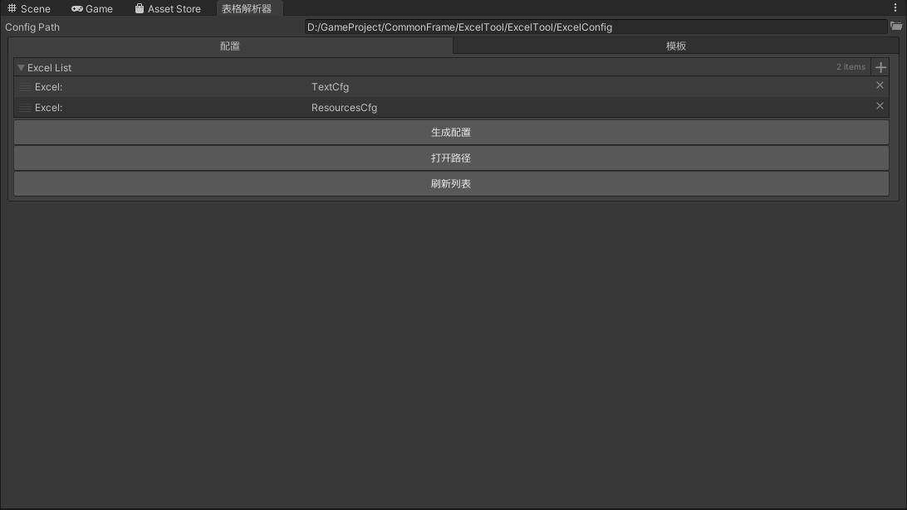

# **Excel配置表 - Config**


*使用Excel配置表来读取和管理游戏数据，可以有效地减少代码中的硬编码，使数据的修改和管理变得更加便捷。将数据存储在Excel表中能够提高灵活性和可维护性，尤其是在处理大量数据时。使用这种数据逻辑分离的方式能让你的开发更加流畅，同时兼顾策划的需求*


## API方法

#### **示例：TextCfg**

Excel数据模板：

| 类型  |  data      |        |       |       |
| ---- | ---------- | -------- | ----------- | ------------- |
| int  | des    | string | bool  | float      |
| ID | Mark | Content | Isunit | Speed |

#### **如何使用：**

#### **获取 ID 为 1 的文本配置**

```
csharp复制代码// 获取 ID 为 1 的文本配置
TextCfg textConfig = TextCfg.Get(1);

if (textConfig != null)
{
    // 打印配置内容
    Debug.Log(textConfig.Content);
}
```

**方法参数说明：**

- `int id`：要获取的文本配置的唯一标识符。

#### **获取所有文本配置**

```
csharp复制代码// 获取所有文本配置
List<TextCfg> allConfigs = TextCfg.GetList();

// 遍历所有配置
foreach (var config in allConfigs)
{
    Debug.Log($"ID: {config.ID}, Content: {config.Content}");
}
```

**方法说明：**

- `GetList()`：返回 `TextCfg` 配置的列表。

#### **获取特定语言的文本内容**

```
csharp复制代码// 获取语言为 English 的文本内容
string englishText = TextCfg.GetLangugeText(1, Language.English);

if (!string.IsNullOrEmpty(englishText))
{
    // 打印指定语言的文本内容
    Debug.Log(englishText);
}
```

**方法参数说明：**

- `int id`：要获取的文本配置的唯一标识符。
- `Language language`：指定语言的枚举值（例如 `Language.English`）


注：请搭配框架中的外置路径中的ExcelTool使用，里面包含着部分示例模板


## ExcelEdit

 Excel拓展工具

 导入框架后点击： SaltFramework —> Excel配置表工具即可打开

 


使用它你可以快速的将Excel数据生成为代码格式，同时提供模板创建功能

**示例：**
+----------------------+
|  加载数据            |
| (LoadData)        
+----------------------+
           |
           v
+----------------------+
|  创建 JSON 文件 | 
| (CreateJson)       |
+----------------------+
           |
           v
+----------------------+
|  创建模板文件      |
| (CreateTemplate)   |
+----------------------+


同时它还会为你创建多语言模块所需要的东西，在你的Excel第二列表就是语言相关的


